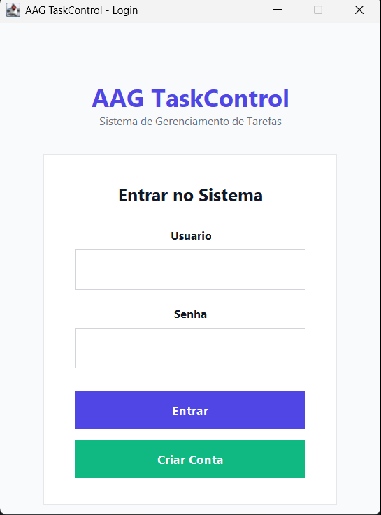

# 📋 AAG TaskControl


> Sistema de Gerenciamento de Tarefas desenvolvido em Java com JavaFX

Um gerenciador de tarefas desktop completo e intuitivo, permitindo organização eficiente de atividades com controle de prioridades, status e prazos.

---

## 📸 Screenshots

### Tela de Login
<p align="center">
  
</p>

### Dashboard Principal
<p align="center">
  
</p>

---

## ✨ Funcionalidades

- ✅ **Autenticação de Usuários**
    - Login e registro de novos usuários
    - Criptografia de senhas
    - Sessão individual por usuário

- 📝 **Gerenciamento Completo de Tarefas (CRUD)**
    - Criar novas tarefas
    - Editar tarefas existentes
    - Excluir tarefas (com confirmação)
    - Visualização em tabela organizada

- 🎯 **Controle de Prioridades**
    - Baixa
    - Média (destaque em amarelo)
    - Alta
    - Crítica

- 📊 **Acompanhamento de Status**
    - Pendente
    - Em Andamento
    - Concluída

- 🔍 **Busca e Filtros**
    - Busca por título, descrição, prioridade ou status
    - Filtros dinâmicos
    - Limpeza rápida de filtros

- 📈 **Estatísticas em Tempo Real**
    - Total de tarefas
    - Tarefas concluídas
    - Tarefas em andamento
    - Tarefas pendentes

- 💾 **Exportação de Dados**
    - Exportar tarefas para CSV
    - Todos os campos incluídos

- 🎨 **Interface Intuitiva**
    - Design moderno e limpo
    - Cores contextuais por prioridade
    - Duplo clique para edição rápida
    - Tooltips e mensagens informativas

---

## 🛠️ Tecnologias Utilizadas

- **Linguagem:** Java 8+
- **Interface Gráfica:** JavaFX
- **Arquitetura:** MVC (Model-View-Controller)
- **Padrões de Projeto:** DAO (Data Access Object), Singleton
- **Persistência:** Serialização de objetos em arquivos
- **IDE:** IntelliJ IDEA / Eclipse / NetBeans

---

## 📋 Pré-requisitos

Antes de executar o projeto, certifique-se de ter instalado:

- **Java JDK 8** ou superior
- **JavaFX SDK** (se não estiver incluído no JDK)
- **Maven** ou **Gradle** (opcional, se estiver usando gerenciador de dependências)

### Verificar instalação do Java:
```bash
java -version
```

---

## 📁 Estrutura do Projeto

```
aag-taskcontrol/
│
├── src/
│   └── com/
│       └── example/
│           └── tarefas/
│               ├── GuiLauncher.java          # Launcher principal
│               ├── SimpleLoginScreen.java    # Tela de login
│               ├── Task.java                 # Modelo de Tarefa
│               ├── TaskRepository.java       # Repositório de dados
│               ├── TaskService.java          # Lógica de negócios
│               ├── TaskManagerUI.java        # Interface principal
│               └── TaskApp.java              # Controlador principal
│
├── out/
│   └── production/
│       └── gerenciador_final/
│           └── tarefas.csv                   # Arquivo de persistência
│
├── imgs/                                     # Screenshots do projeto
│   ├── img.png                               # Tela de Login
│   └── img_1.png                             # Dashboard
│
├── README.md                                 # Este arquivo
└── .gitignore
```

---

## 👥 Equipe de Desenvolvimento

| Nome | GitHub | E-mail |
|------|--------|--------|
| **Antônio Fernandes** | [@antoniofernandesz](https://github.com/antoniofernandesz) | antoniofernandesz1997@gmail.com |
| **Adrien Valerio** | [@adrienvalerio](https://github.com/adrienvalerio) | adrienvalerio2022@gmail.com |
| **Gabriel Gomes** | [@gabrielgomes](https://github.com/gabrielgomes) | lgbonfimlg@gmail.com |

---

## 📚 Documentação Adicional

- [Documento de Requisitos](docs/DOCUMENTO_REQUISITOS.md)
- [Planejamento de Sprints](docs/SPRINTS.md)
- [Manual do Usuário](docs/MANUAL_USUARIO.md)

---

## 🎯 Roadmap / Melhorias Futuras

- [ ] Implementar banco de dados relacional (MySQL/PostgreSQL)
- [ ] Adicionar categorias/tags para tarefas
- [ ] Sistema de notificações para prazos próximos
- [ ] Tema dark mode
- [ ] Sincronização em nuvem
- [ ] Aplicativo mobile (Android/iOS)
- [ ] Relatórios e gráficos de produtividade
- [ ] Integração com calendário
- [ ] Sistema de subtarefas
- [ ] Trabalho em equipe (compartilhamento de tarefas)

---

## 🐛 Problemas Conhecidos

- Nenhum problema crítico conhecido no momento
- Reportar bugs através das [Issues](https://github.com/seu-usuario/aag-taskcontrol/issues)

---

## 🙏 Agradecimentos

- Agradecimentos especiais aos professores e colegas que contribuíram com feedback
- Comunidade JavaFX pela documentação e suporte
- Todos que testaram e ajudaram a melhorar o sistema

---

<p align="center">
  Desenvolvido por <strong>Antônio Fernandes, Adrien Valerio e Gabriel Gomes</strong>
</p>


---

**Versão Atual:** 2.0 Pro  
**Última Atualização:** Dezembro 2025
